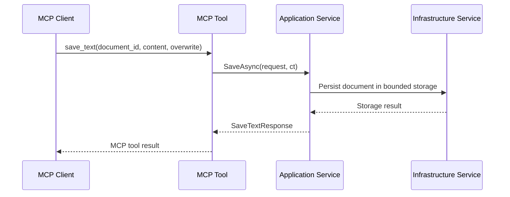
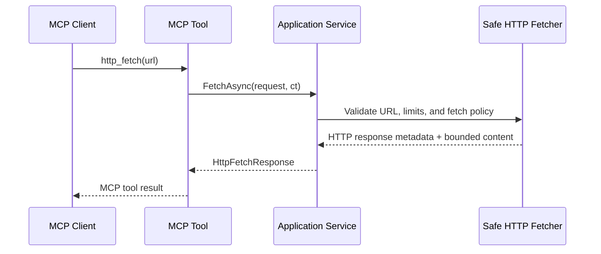

## Context

The template currently demonstrates MCP wiring, layered architecture, and host-level operational concerns, but its sample capabilities remain intentionally trivial. This change introduces a generic sample that is still easy to understand, yet realistic enough for .NET developers to reuse as a reference when building their own MCP servers.

The design must stay aligned with the repository architecture: MCP SDK integration remains isolated in the MCP adapter, transport-independent logic lives in the Application layer, infrastructure concerns are encapsulated behind ports, and hosts only compose services and operational middleware. The sample must avoid domain-specific language, avoid speculative abstractions, and remain testable without introducing external services or databases.

## Goals / Non-Goals

**Goals:**
- Provide a coherent set of sample tools that support an end-to-end content workflow.
- Demonstrate clear contracts, bounded side effects, and explicit validation patterns.
- Show how to structure MCP tools around application services instead of embedding logic in adapters.
- Keep the sample generic and transport-agnostic while still feeling useful and credible.
- Document the conceptual split between MCP-visible diagnostics and host-level operational endpoints.
- Preserve the template's minimal-by-default posture by keeping the sample footprint optional through `template.json`.

**Non-Goals:**
- Build a general-purpose file management server.
- Implement an advanced search engine, transformation DSL, or crawler.
- Support arbitrary filesystem access, arbitrary outbound HTTP behavior, or user-provided code execution.
- Introduce external infrastructure such as databases, queues, or hosted APIs.

## Decisions

### Decision: Model the sample as a content utility workflow
The sample will be presented as a generic content utility server rather than a toolbox of unrelated commands.

Rationale:
- The tool set becomes easier to explain and easier for users to compose.
- The sample demonstrates realistic tool chaining without inventing business-specific language.

Alternatives considered:
- Keep independent sample tools with no shared workflow: rejected because it remains instructional but not demonstrative.
- Introduce a domain-specific sample: rejected because it narrows reuse and weakens the template value.

### Decision: Keep the expanded sample under the existing template opt-in flag
The new sample footprint will remain controlled by `.template.config/template.json` using the existing `--include-sample-tools` parameter, and exclusion rules will cover all sample-only code, tests, and documentation that would otherwise leave the generated scaffold inconsistent.

Rationale:
- The template already defines sample tools as optional content and should remain minimal by default.
- Leaving even one active demonstration tool in the default scaffold would make `--include-sample-tools=false` semantically ambiguous.
- A larger sample set increases the risk of partially generated scaffolds unless inclusion and exclusion are managed centrally in `template.json`.
- This keeps the generated project aligned with the documented promise in the template capability.

Alternatives considered:
- Include the new sample by default: rejected because it increases scaffold size and noise for users who want a minimal starting point.
- Add a second template flag just for advanced samples: rejected because the current `--include-sample-tools` flag already communicates the intent well enough.
- Keep a hyper-simple active tool such as `echo` in the default scaffold: rejected because it weakens the opt-in model and leaves two competing sample stories in the template.

### Decision: Use bounded local storage with document identifiers
Text persistence will use stable `document_id` values and a server-controlled local storage root. Contracts will not expose raw filesystem paths.

Rationale:
- Persistence becomes credible and survives process restarts.
- The sample demonstrates infrastructure encapsulation and storage safety.
- Search can remain simple because the corpus is local and bounded.

Alternatives considered:
- In-memory storage only: rejected because it weakens the demonstration value of `save_text`, `read_text`, and `search_text`.
- Arbitrary path-based file access: rejected because it encourages unsafe patterns.

### Decision: Keep JSON transformation intentionally narrow
`transform_json` will begin with a single deterministic operation, `project`, driven by an explicit field map.

Rationale:
- The tool remains easy to explain and easy to test.
- The sample demonstrates transformation without becoming a mini-language.

Alternatives considered:
- Multiple operations in v1: rejected because it increases contract and test complexity too early.
- General expression-based transformation: rejected because it obscures intent and increases risk.

### Decision: Separate validation from transformation
`validate_json_schema` and `transform_json` remain separate tools rather than a single overloaded JSON tool.

Rationale:
- Each tool has one responsibility and a simpler contract.
- Validation errors and transformation errors remain easy to distinguish.

Alternatives considered:
- Single `process_json` tool: rejected because it hides capability boundaries and complicates responses.

### Decision: Constrain outbound HTTP aggressively
`http_fetch` will support safe read-only fetch behavior with explicit limits for scheme, timeout, redirects, response size, and response content types.

Rationale:
- The sample can demonstrate a realistic network-facing tool without normalizing unsafe defaults.
- It provides a concrete reference for SSRF-aware design in MCP tools.

Alternatives considered:
- Fully configurable HTTP client behavior: rejected because it adds power faster than clarity.
- Omit outbound HTTP entirely: rejected because it removes a useful and commonly requested sample pattern.

### Decision: Distinguish MCP health diagnostics from HTTP host health
`health_check` will expose server diagnostics that are useful from inside an MCP client session. It will not replace or redefine the HTTP `/health` endpoint.

Rationale:
- The repository already has host-level health behavior.
- The sample should show that operational endpoints and MCP capabilities can coexist without overlap.

Alternatives considered:
- Mirror `/health` exactly as an MCP tool: rejected because it duplicates responsibilities.

## Risks / Trade-offs

- [Local file-backed storage increases infrastructure surface] -> Keep storage rooted under a server-controlled directory and prohibit arbitrary paths in public contracts.
- [Safe `http_fetch` may feel restrictive] -> Document that the restriction is intentional and aligned with sample best practices.
- [Three capability groups can still feel broad] -> Keep each contract small and avoid optional parameters unless they are essential.
- [The sample could drift toward utility sprawl] -> Reject extra tools unless they strengthen the core content workflow.
- [Users may confuse `health_check` with `/health`] -> Document the distinction in capabilities and operations documentation.

## Migration Plan

1. Add contracts and application ports for the new content storage, JSON processing, runtime, and diagnostics flows.
2. Add infrastructure implementations for bounded local storage, safe outbound HTTP, and any reusable validation helpers.
3. Expose the new services through MCP tools in the MCP adapter project.
4. Update `.template.config/template.json` so the sample footprint is included only when `--include-sample-tools` is enabled and excluded cleanly otherwise.
5. Update capability documentation and sample descriptions to explain the new tool set and how the tools compose.
6. Add tests across application, infrastructure, MCP adapter, host layers, and template generation paths where transport-specific behavior matters.

No data migration is required because the repository currently ships only minimal sample tools.

## Open Questions

- Should local storage be enabled by default under a deterministic sample directory, or require explicit configuration before write tools are active?
- Should `http_fetch` allow plain `http` for localhost-only development scenarios, or require `https` by default with opt-in relaxation?
- Should `health_check` include storage path diagnostics, or limit itself to storage availability and configuration state? yes include storage path diagnostics. 
- Which sample-only files should be excluded with `--include-sample-tools=false` beyond MCP tool classes and MCP tests, especially sample-facing documentation and configuration examples? 