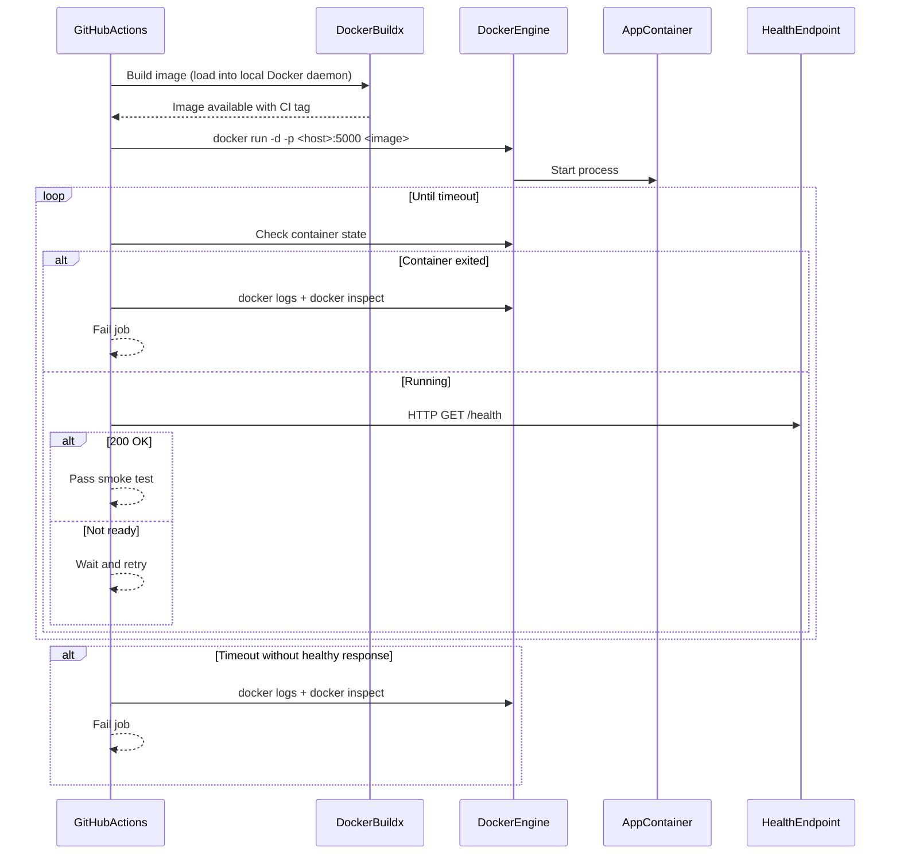

## Context

The CI workflow currently validates .NET restore/build/test and Docker image build, but it does not validate runtime startup behavior of the built image. This allows a class of failures where the image builds successfully while the container fails at startup (for example, runtime/framework mismatch after Docker base image updates).

The change must preserve the existing update signal from dependency automation while adding a runtime safety gate. The affected path is the CI workflow and Docker runtime validation, not application-layer business logic.

## Goals / Non-Goals

**Goals:**
- Validate that the built Docker image can start as a container in CI.
- Validate that the HTTP host becomes reachable via `/health` within a bounded startup window.
- Fail fast with actionable diagnostics (`docker logs`, `docker inspect`) when runtime startup fails.
- Keep Dependabot visibility for Docker updates while enforcing runtime correctness.

**Non-Goals:**
- Replacing existing unit/integration test strategy.
- Introducing environment-specific end-to-end scenarios beyond startup/health smoke validation.
- Changing application architecture or layer boundaries.
- Auto-managing Dependabot policy from this change.

## Decisions

### Decision 1: Add a runtime smoke-test phase to CI after image build

The CI Docker job will not stop at `docker build`; it will run the built image as a container and validate startup.

**Rationale:**
- Directly detects the failure mode observed in dependency update PRs.
- Keeps validation close to production packaging assumptions.

**Alternatives considered:**
- Keep build-only validation: rejected, does not detect runtime incompatibility.
- Add only static Dockerfile linting/version checks: rejected, useful but insufficient to prove startup behavior.

### Decision 2: Use health endpoint probing as readiness criterion

The smoke test will poll `GET /health` on the mapped host port with retries and a strict timeout budget.

**Rationale:**
- `/health` is the explicit service liveness/readiness surface in this template.
- Gives deterministic pass/fail behavior and bounded execution time.

**Alternatives considered:**
- Check only container process state (`running`): rejected, process may run while service is not ready.
- Use only Docker `HEALTHCHECK` status: rejected as sole signal due to slower cadence and less direct control of timeout in workflow.

### Decision 3: Fail fast on container exit and always capture diagnostics on failure

If the container exits before readiness, the job fails immediately and captures logs + inspect output.

**Rationale:**
- Reduces feedback latency in PRs.
- Improves troubleshooting for runtime incompatibility and startup exceptions.

**Alternatives considered:**
- Retry full container runs multiple times: rejected for now (adds runtime and noise for deterministic startup issues).

### Decision 4: Keep change scoped to CI pipeline capability

This change modifies `ci-pipeline` requirements and workflow behavior only.

**Rationale:**
- The problem is validation coverage, not functional API behavior.
- Keeps implementation minimal and focused.

## Sequence Diagram

## Risks / Trade-offs

- [Risk] CI duration increases due to startup polling → Mitigation: strict timeout budget and short polling interval.
- [Risk] Flaky failures from transient startup latency → Mitigation: bounded retries with deterministic failure criteria and clear logs.
- [Risk] Port collisions on runner host → Mitigation: use a dedicated CI port and cleanup container in all outcomes.
- [Risk] Additional workflow complexity → Mitigation: keep smoke test minimal (startup + `/health` only).

## Migration Plan

1. Extend CI workflow build job to produce a runnable local image and execute runtime smoke-test steps.
2. Add readiness loop against `/health` with timeout and fail-fast on container exit.
3. Add failure-path diagnostics (`docker logs`, `docker inspect`) and cleanup step.
4. Validate behavior against two scenarios:
   - Known-good Docker/runtime combination (should pass).
   - Intentional runtime mismatch in a branch (should fail with clear diagnostics).
5. Rollback strategy: remove runtime smoke-test steps and restore previous build-only behavior if the change causes unacceptable CI instability.

## Open Questions

- Should the workflow also enforce an explicit major-version alignment check between target framework and Docker base image tags as an early guard?
- Should health probing reuse Docker `HEALTHCHECK` status as secondary signal in addition to direct HTTP probing?
- What is the acceptable startup timeout budget for this repository (speed vs false negatives)?
