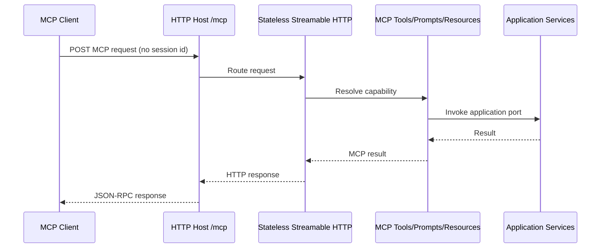

## Context

The template centralizes its MCP SDK version at 1.3.0. Its HTTP host configures the transport separately from the MCP tools, prompts, and resources, then tests the prior stateful behavior that rejects ordinary MCP requests without a session identifier. SDK v2.0.0 defaults Streamable HTTP to stateless operation and no longer enables legacy SSE endpoints by default.

The template must remain a runnable .NET 10 scaffold with the Application layer independent of MCP and transport concerns. Stdio remains a supported transport and must continue sharing the same MCP adapter capabilities.

## Goals / Non-Goals

**Goals:**
- Move all MCP SDK package consumers to the centralized 2.0.0 version.
- Make the HTTP host's stateless Streamable HTTP choice explicit and testable.
- Preserve a single shared registration of tools, prompts, and resources for both hosts.
- Replace session-labelled telemetry with request-concurrency telemetry.
- Give generated-server users clear migration guidance.

**Non-Goals:**
- Add Tasks, OAuth, elicitation, resource subscriptions, or server-to-client notifications.
- Provide legacy SSE or stateful-session compatibility by default.
- Change application service interfaces, business logic, authentication modes, or authorization behavior.
- Upgrade unrelated dependencies.

## Decisions

### Use SDK 2.0.0 as a single centralized baseline

Update `ModelContextProtocolVersion` once in `Directory.Build.props`; all existing package references continue to consume that property. This preserves the template's existing package-management convention and prevents host/adapter protocol mismatches.

**Alternative considered:** Allow package versions to diverge per host. Rejected because the adapter and transports form one protocol surface and mixed SDK versions make generated projects hard to support.

### Explicitly configure stateless Streamable HTTP

The HTTP host will configure `WithHttpTransport` with `Stateless = true`. `MapMcp("/mcp")` remains the single HTTP endpoint. Legacy SSE remains disabled and stateful sessions are not configured.

**Alternative considered:** Rely on v2 defaults. Rejected because explicit configuration documents the template contract and protects generated code if a future SDK changes its default.

**Alternative considered:** Keep `Stateless = false` with legacy SSE. Rejected because no current capability requires server-initiated communication or resource subscriptions, while retaining it perpetuates session affinity and an obsolete client path.

### Build one MCP server registration and attach transport per host

`AddMcpTemplateModules` will create the MCP server builder, register shared MCP capabilities, and return that builder. Each host will add exactly its transport to the returned builder. This removes the current pattern of separate `AddMcpServer()` invocations and makes the capability-to-transport composition unambiguous.

**Alternative considered:** Keep independent server registration calls and verify their merge behavior. Rejected because it depends on SDK registration internals and risks associating a transport with a different server builder than the registered capabilities.

### Measure requests, not sessions

Replace `mcp_sessions_active` and its increment/decrement API with `mcp_requests_in_flight`. Middleware increments it immediately before forwarding a `/mcp` request and decrements it in `finally`; `mcp_requests_total` remains the completed/received flow counter.

**Alternative considered:** Keep the old metric name but redefine it as request concurrency. Rejected because the name would mislead operators and violate Prometheus metric semantics.

### Test protocol behavior through the HTTP host

Integration tests will verify a sessionless request succeeds when otherwise valid and invalid protocol-version input remains rejected. Tests will not assert internal SDK implementation details or require an `initialize` handshake for stateless requests.

## Risks / Trade-offs

- [Legacy clients use `/sse`, `/message`, or rely on session IDs] -> Document the breaking migration and require downstream owners to opt into a temporary stateful compatibility configuration outside the template default.
- [SDK v2 changes builder APIs beyond transport defaults] -> Restore, build, and run the HTTP and stdio test suites before altering behavior; adapt only the MCP adapter and hosts.
- [Metric-name replacement breaks dashboards and alerts] -> Document removal of `mcp_sessions_active` and addition of `mcp_requests_in_flight` as a breaking operational change.
- [A sessionless request test can be invalid for reasons other than session state] -> Construct the request using a negotiated v2-compatible protocol path and assert an MCP result rather than only asserting a non-400 response.

## Migration Plan

1. Update the centralized SDK version and refactor MCP registration to one shared builder per host.
2. Configure HTTP stateless mode explicitly, replace session assumptions in integration tests, and confirm stdio still starts.
3. Rename request-concurrency instrumentation and update metrics tests.
4. Update README and operations guidance, including the downstream migration note for stateful/SSE clients.
5. Run restore, build, targeted host tests, full test suite, and template package/generation validation.

Rollback consists of restoring the prior package version and stateful HTTP configuration in a release branch. Generated projects already upgraded to stateless v2 would need the documented downstream compatibility configuration rather than a transparent server-side rollback.

## Open Questions

- Which currently supported MCP clients need explicit release-note migration examples beyond the generic Streamable HTTP guidance?
- Should a future optional template flag provide legacy stateful/SSE compatibility, or should that remain a downstream customization only?
